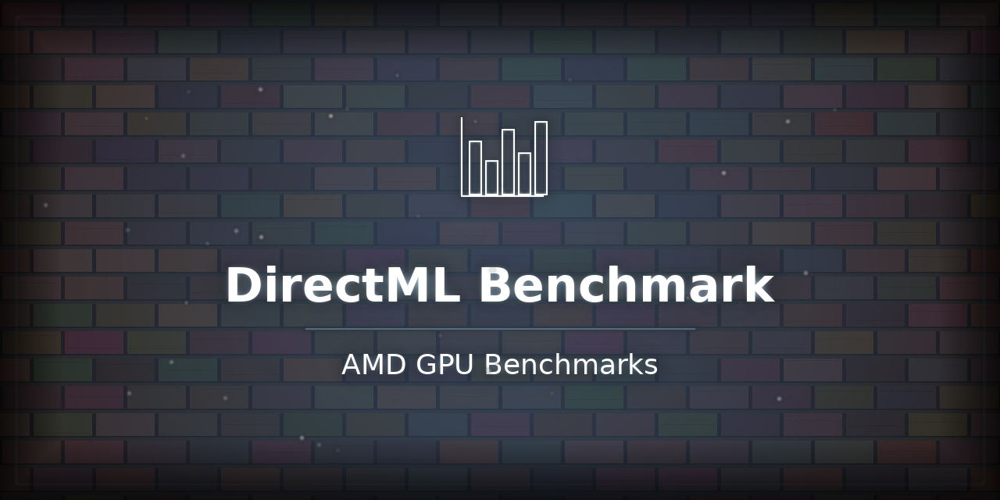

<p align="center"></p>

# directml-benchmark

**Reproducible float32 GPU performance benchmarks — AMD, NVIDIA, Apple Silicon, CPU.**

No estimated numbers. No invented results. Every row in the results table comes from a real hardware run with a timestamped JSON file you can inspect and reproduce.

> Related repos:
> [torch-amd-setup](https://github.com/ChharithOeun/torch-amd-setup) — AMD GPU auto-detection for PyTorch |
> [jax-amd-gpu-setup](https://github.com/ChharithOeun/Chharbot/tree/main/jax-amd-gpu-setup) — JAX on AMD

---

## Results

Workload: `torch.bmm` — batched float32 matrix multiply, shape `(32 × 512 × 512)`.
100 warmup iterations + 100 timed iterations. Wall-clock `time.perf_counter`.

| GPU | OS | CPU Baseline | GPU | Speedup | Verified | File |
|-----|----|-------------|-----|---------|----------|------|
| AMD Radeon RX 5700 XT | Windows 11 | 250.4 ms · 0.55 TFLOPS | 6.2 ms · 22.04 TFLOPS | **40.2×** | ✅ 2026-03-23 | [JSON](results/RX_5700_XT_DirectML_20260323.json) |

**Legend:**
- ✅ = measured on real hardware, JSON result file included
- 🔬 = community submitted, not yet independently confirmed

> **Run `python benchmark.py` and open a PR to add your GPU →** [CONTRIBUTING.md](CONTRIBUTING.md)

---

## Platforms Supported

| Platform | Backend | Notes |
|----------|---------|-------|
| **Windows** | DirectML | AMD / Intel / NVIDIA via `torch-directml`. Python 3.11 only (hard ceiling). |
| **Linux** | ROCm | AMD GPU. RX 5700 XT needs `HSA_OVERRIDE_GFX_VERSION=10.3.0`. |
| **Linux** | CUDA | NVIDIA GPU. Standard torch install. |
| **macOS** | MPS | Apple Silicon (M1/M2/M3). `torch.backends.mps`. |
| **Any** | CPU | Baseline — always runs on any machine. |

`benchmark.py` auto-detects the best available device. Use `--check` to see what was found before running.

---

## Quick Start

### Step 0 — Check your environment first

```bash
python benchmark.py --check
```

This prints your Python version, torch version, and which GPU backends are available. Run this before anything else.

---

### Windows (DirectML — AMD / Intel / NVIDIA GPU)

> **Requires Python 3.11** — torch-directml is compiled against the 3.11 ABI and will not work on 3.12+.

```bat
REM Option A — one-click installer (recommended)
install.bat

REM Option B — manual steps
py -3.11 -m venv .venv311
.venv311\Scripts\activate
pip install torch-directml          <- do NOT pre-install torch
python benchmark.py --check         <- verify
python benchmark.py                 <- run
```

If you are on Python 3.12+, either install Python 3.11 alongside it (`py -3.11`) or use the CPU-only path.

---

### Linux — AMD GPU (ROCm)

```bash
# Option A — one-click installer
bash install.sh --rocm

# Option B — manual steps
pip install torch --index-url https://download.pytorch.org/whl/rocm6.1

# RX 5700 XT (gfx1010) only — not in ROCm's default allow-list
export HSA_OVERRIDE_GFX_VERSION=10.3.0

python3 benchmark.py --check
python3 benchmark.py
```

**ROCm version matrix:**

| GPU series | ROCm support | Notes |
|------------|-------------|-------|
| RX 5000 (gfx1010) | Unofficial | Requires `HSA_OVERRIDE_GFX_VERSION=10.3.0` |
| RX 6000 (gfx1030) | ✅ Official ROCm 5.3+ | No override needed |
| RX 7000 (gfx1100) | ✅ Official ROCm 5.5+ | No override needed |

---

### Linux — NVIDIA GPU (CUDA)

```bash
bash install.sh --cuda

# Or manually:
pip install torch --index-url https://download.pytorch.org/whl/cu121
python3 benchmark.py --check
python3 benchmark.py
```

---

### macOS — Apple Silicon (MPS)

```bash
# MPS is included in the standard torch package
pip install torch
python3 benchmark.py --check
python3 benchmark.py
```

MPS (`torch.backends.mps`) requires macOS 12.3+ with an M1/M2/M3 chip.

---

### CPU only — Any OS, any Python version

```bash
# Linux / macOS
pip install torch --index-url https://download.pytorch.org/whl/cpu
python3 benchmark.py --cpu-only

# Windows
install.bat --cpu
python benchmark.py --cpu-only
```

---

## CLI Reference

```
python benchmark.py [options]

  --check         Verify environment without running (start here!)
  --cpu-only      CPU baseline only — no GPU needed
  --device X      Force device: directml | cuda | rocm | mps | cpu
  --batch N       Batch size (default: 32)
  --size N        Matrix N×N size (default: 512)
  --warmup N      Warmup iterations (default: 100)
  --iters N       Timed iterations (default: 100)
  --output PATH   Custom output JSON path
```

---

## How the Benchmark Works

```
Shape    : A = (batch × N × N),  B = (batch × N × N),  float32
Operation: torch.bmm(A, B)
FLOPs    : 2 × batch × N³ per iteration  (multiply + add, FMA = 2 ops)
Sync     : CUDA/ROCm → torch.cuda.synchronize()
           DirectML  → a[0,0,0].item()  (no .synchronize() available)
           MPS       → torch.mps.synchronize()
           CPU       → no sync needed
Timing   : time.perf_counter  (wall clock, not CUDA events)
TFLOPS   : (2 × batch × N³ × iters) / elapsed_seconds / 1e12
```

---

## Troubleshooting

### Windows

**`ModuleNotFoundError: No module named 'torch_directml'`**
You are on Python 3.12+. DirectML requires ≤ 3.11. Install Python 3.11:
```bat
py -3.11 -m venv .venv311
.venv311\Scripts\activate
pip install torch-directml
```

**`pip install torch-directml` fails with version conflicts**
You pre-installed torch. Uninstall it first, then let directml pull torch 2.4.1 automatically:
```bat
pip uninstall torch -y
pip install torch-directml
```

**GPU benchmark runs but results look like CPU speed**
torch-directml is installed but tensors are on CPU. Make sure you're using `dml.device()` (the device object), not the string `"privateuseone:0"`. The benchmark handles this correctly — if you see this, open an issue.

**`privateuseone:0` in device string**
This is normal and expected. DirectML registers as a custom PyTorch backend. Your GPU is working.

---

### Linux (ROCm)

**`RuntimeError: HIP error: invalid device function`** or blank screen
Your GPU is not in ROCm's default allow-list. For RX 5700 XT (gfx1010):
```bash
export HSA_OVERRIDE_GFX_VERSION=10.3.0
python3 benchmark.py
```
Add this to `~/.bashrc` to make it permanent.

**`rocminfo` shows version 5.0.0 and fails**
Ubuntu ships a stub `rocminfo`. Remove it before installing ROCm:
```bash
sudo apt remove rocminfo
# Then install ROCm: https://rocm.docs.amd.com/en/latest/deploy/linux/quick_start.html
```

**`torch.cuda.is_available()` returns False after ROCm install**
Check: `rocm-smi` shows your GPU. Then:
```bash
python3 -c "import torch; print(torch.version.hip)"
```
If this returns `None`, you installed the CPU-only torch wheel. Reinstall:
```bash
pip install torch --index-url https://download.pytorch.org/whl/rocm6.1
```

**`/dev/kfd: Permission denied`**
Add yourself to the `render` and `video` groups:
```bash
sudo usermod -aG render,video $USER
# Log out and back in, then retry
```

---

### macOS

**`torch.backends.mps.is_available()` returns False**
Requires macOS 12.3+ with Apple Silicon. Check:
```bash
python3 -c "import platform; print(platform.mac_ver())"
```
Intel Macs do not support MPS — use CPU-only mode.

---

### All Platforms

**numpy 2.x errors / ABI mismatch**
```bash
pip install "numpy<2.0"
```

**`benchmark.py --check` shows no GPU but you have one**
Run `python3 benchmark.py --check` and read the output carefully. Each GPU path (CUDA, MPS, DirectML) has a separate ✅/❌ line. The most common cause is installing the wrong torch wheel (e.g. CPU wheel when you need ROCm).

---

## Verification Policy

> **No fabricated numbers. No guessing. No estimated timings.**
>
> Every benchmark in this repository was run on physical hardware.
> Timing uses `time.perf_counter` with warmup. Results include the exact
> software stack (torch version, Python version, OS) in the JSON file.
>
> If a number can't be verified with a real hardware run, it doesn't appear here.

See [CHANGELOG.md](CHANGELOG.md) for full history.

---

## Keywords

`AMD DirectML benchmark` · `torch-directml performance` · `RX 5700 XT PyTorch`
`AMD GPU Windows PyTorch` · `DirectML vs CPU speedup` · `torch-directml float32`
`AMD ROCm benchmark` · `GPU matmul performance` · `privateuseone device PyTorch`
`AMD Radeon GPU machine learning` · `PyTorch GPU benchmark Windows`
`gfx1010 PyTorch` · `WSL2 ROCm benchmark` · `Apple Silicon MPS benchmark`
`cross-platform GPU benchmark` · `NVIDIA CUDA benchmark Python`

---


## Contributing

Contributions are welcome! To contribute:

1. **Fork** the repository and create a feature branch:
   ```
   git checkout -b fix/your-fix
   ```
2. **Test** your changes locally before submitting.
3. **Open a Pull Request** describing what you changed and why.

### Reporting Issues

Open a GitHub Issue and include your OS version, GPU model, driver version, and the exact error message.

---
## License

MIT — see [LICENSE](LICENSE)

---

## Support This Work

If this saved you time, consider buying me a coffee:

[](https://buymeacoffee.com/chharith)
